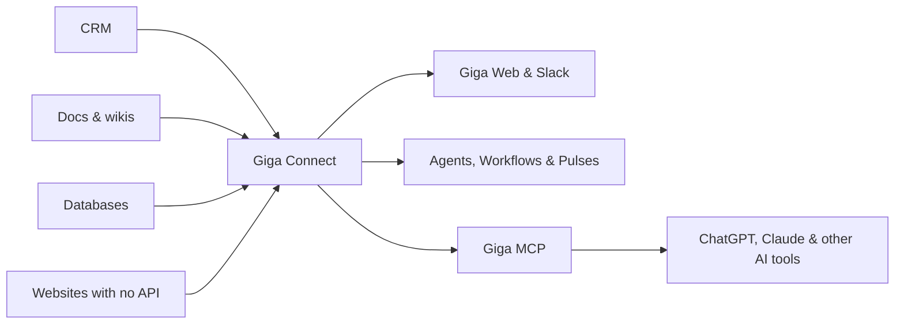

**Giga Connect** is how you connect your team's tools to Giga — your CRM, docs, analytics, databases, support desk, and the rest.

The key idea: **connect a tool once, then use it everywhere.** Once a tool is connected to Giga, you can use it from Giga Web and Slack, from your Agents, Workflows and Pulses — and from other AI tools like ChatGPT and Claude through [Giga MCP](/mcp/index), without connecting each app there separately.

[Learn how to use your connected tools from other AI tools →](/mcp/index)

## What you can connect

Giga has a catalog of apps you can browse and search by category. If a tool is in the catalog, connecting it is usually a couple of clicks.

Different tools connect in different ways. Giga picks the right one for each app, and some apps offer more than one:

- **OAuth:** approve access on the app's own sign-in screen
- **Email and password:** enter your login details in Giga's secure form
- **API key:** paste a key or access token into Giga's secure form
- **MCP server:** connect an app's MCP server so Giga can use its tools
- **Database:** connect a database so Giga can look things up in it
- **Cloud browser:** sign in to a website once, for sites with no other way in
- **Other agents:** hand work off to another AI agent your company runs

Some tools have their own setup: **Slack** installs into your workspace, and **WhatsApp** connects by scanning a QR code.

You can connect **more than one account** for the same app — for example a production and a test account — and give each a clear name.

## How to connect a tool

<Columns cols={2}>
  <Card title="From the Integrations page" icon="layout-grid">
    Find the app, choose how you want to connect, and follow the steps.
  </Card>
  <Card title="From a chat" icon="message-square">
    Ask Giga to connect something. It sends you a secure setup link — no need to leave the conversation.
  </Card>
  <Card title="From ChatGPT or Claude" icon="sparkles">
    Giga can show a connect card right inside the chat.
  </Card>
  <Card title="During onboarding" icon="rocket">
    Pick the tools your work lives in and connect them one after another.
  </Card>
</Columns>

After connecting, give the connection a name so you and your team can tell it apart.

> **Keep secrets out of chat**
>
> Always use the secure setup form for passwords, API keys and tokens rather than pasting them into a message.

## Tools that aren't in the catalog

If the tool you need isn't listed, you still have options:

- **Ask Giga to add it.** Giga can work out how the tool connects and create a private integration just for your workspace.
- **Bring your own MCP server.** Point Giga at your company's own MCP server.
- **Bring your own OAuth app.** Use your company's own sign-in app for a tool, and share that setup with your workspace — teammates still sign in with their own accounts.
- **Use the cloud browser.** For websites with no API, Giga can work in the site directly. If a login needs a CAPTCHA or 2FA, Giga sends you a link to sign in yourself, then reuses that sign-in next time.

## Sharing connections with your team

New connections are **private by default** — only you can use them.

You can share a connection with a [Group](/groups/index) (or with a specific person), and everyone with access can use it in their chats, Agents and Pulses.

| | Can use it | Can rename, rotate or disconnect it |
| --- | --- | --- |
| **The person who added it** | ✅ | ✅ |
| **People it's shared with** | ✅ | — |

Sharing never gives more access than the connected account itself has in the app. [How sharing works with secrets →](/connect/security#sharing-without-exposing)

## Managing your connections

Each connection shows who added it and its current status:

- 🟢 **Healthy** — working normally
- 🔴 **Needs reconnect** — the sign-in expired or was revoked
- ⚪ **Disconnected**

Giga checks your connections every day, refreshes sign-ins automatically where it can, and sends you a single Slack message listing anything that needs reconnecting.

From a connection you own, you can:

- **Rename** it or add a note
- **Rotate** the key or password
- **Reconnect** it if it stopped working
- **Disconnect** it — this removes it for everyone it was shared with

## How Giga uses your connections

When you or a teammate works with Giga, it only uses the connections that person is allowed to use: their own, plus those shared with them.

- **Chats** can use any connection you have access to, and you can @-mention one to point Giga at it.
- **Tracks** can have connections and databases linked to them.
- **[Agents](/agents/index)** and **[Workflows](/workflows/index)** use connections as part of their work.
- **[Pulses](/pulses/index)** run as the person who owns them, using that person's connections.

## Safety and security

When Giga uses one of your connections, the request goes through Giga's **secure proxy**, which adds your key or token on Giga's servers. For API keys, OAuth sign-ins, databases and MCP servers, the AI does the work without ever seeing the secret.

[Read how Giga keeps your connections safe →](/connect/security)

## Frequently asked questions

<ExpandableGroup>
  <Expandable title="Can I connect more than one account for the same app?">
    Yes. Connect as many accounts as you need, for example a production and a test account, and give each a clear name so you and your team can tell them apart.
  </Expandable>
  <Expandable title="Who can use a connection I add?">
    Only you, until you share it. You can share a connection with a Group or with a specific person. People you share with can use it, but only you can rename, rotate or disconnect it.
  </Expandable>
  <Expandable title="The tool I need isn't in the catalog. What can I do?">
    Ask Giga to add it. Giga can work out how the tool connects and create a private integration just for your workspace. You can also bring your own MCP server or OAuth app.
  </Expandable>
  <Expandable title="A connection says Needs reconnect. What happened?">
    The sign-in expired or was revoked in the app. Click **Reconnect** and sign in again. Giga also checks your connections daily and messages you in Slack when one needs attention.
  </Expandable>
  <Expandable title="I can see a connection but can't edit it. Why?">
    Someone else added it and shared it with you. Only the person who added a connection can manage it.
  </Expandable>
  <Expandable title="Giga can read from an app but can't make changes. Why?">
    The connected account may not have permission to make changes in the app itself. Giga never gets more access than the account you connected.
  </Expandable>
  <Expandable title="Can the AI see my passwords and API keys?">
    No, with one exception. API keys, OAuth tokens and database credentials are added by Giga's secure proxy, so the AI never sees them. Email and password logins are the exception: Giga needs the real password to sign in for you, and every use is logged. [Learn more →](/connect/security)
  </Expandable>
  <Expandable title="The browser login is stuck on a CAPTCHA or 2FA. What do I do?">
    Use the sign-in link Giga sends you to complete the login yourself. Giga reuses that sign-in next time.
  </Expandable>
</ExpandableGroup>
