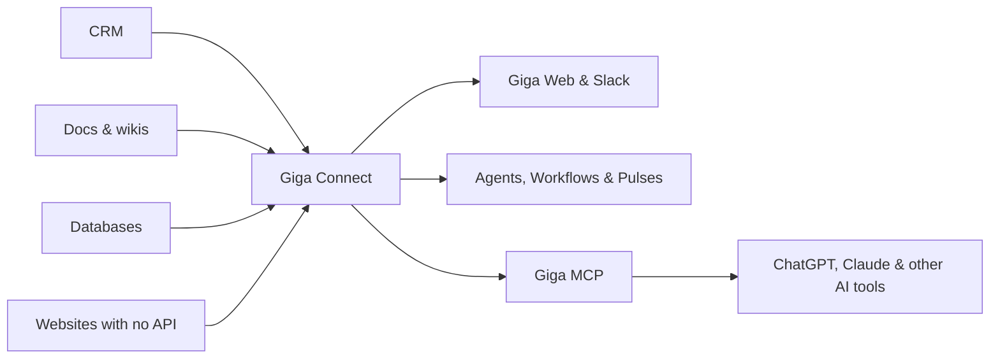

**Giga Connect** is how you connect your team's tools to Giga — your CRM, docs, analytics, databases, support desk, and the rest.

The key idea: **connect a tool once, then use it everywhere.** Once a tool is connected to Giga, you can use it from Giga Web and Slack, from your Agents, Workflows and Pulses — and from other AI tools like ChatGPT and Claude through [Giga MCP](/mcp/index), without connecting each app there separately.

[Learn how to use your connected tools from other AI tools →](/mcp/index)

## What you can connect

Apps from Giga's catalog, your own MCP servers, APIs, PostgreSQL databases, and even websites with no API at all through Giga's cloud browser. If a tool isn't in the catalog, Giga can add it just for your workspace.

[See how to connect your tools →](/connect/connecting)

## How Giga uses your connections

When you or a teammate works with Giga, it only uses the connections that person is allowed to use: their own, plus those shared with them.

- **Chats** can use any connection you have access to, and you can @-mention one to point Giga at it.
- **Tracks** can have connections and databases linked to them.
- **[Agents](/agents/index)** and **[Workflows](/workflows/index)** use connections as part of their work.
- **[Pulses](/pulses/index)** run as the person who owns them, using that person's connections.

## Explore Giga Connect

<Columns cols={3}>
  <Card title="Connecting your tools" href="/connect/connecting" icon="plug">
    What you can connect, the ways to connect, and tools that aren't in the catalog.
  </Card>
  <Card title="Sharing and managing" href="/connect/sharing" icon="users">
    Share connections with your team and keep them healthy.
  </Card>
  <Card title="Safety and security" href="/connect/security" icon="shield-check">
    How Giga keeps your passwords, keys and tokens safe.
  </Card>
</Columns>
