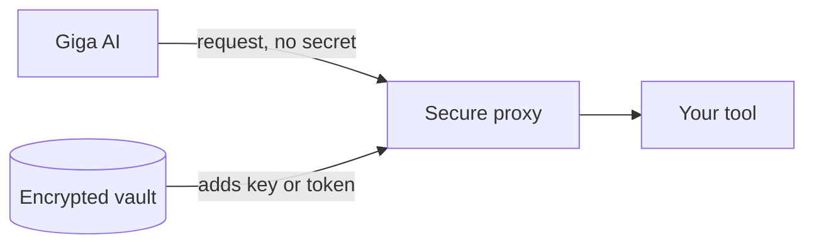

Connecting your tools to an AI raises a fair question: **what can the AI actually see?**

For almost every connection, the answer is: not your secrets. Giga uses your tools on your behalf without the AI ever handling the password, key or token behind them.

## The secure proxy

When Giga uses one of your connections, the request goes through Giga's **secure proxy**. The proxy adds your key or token on Giga's servers just before the request leaves, so the AI does the work without ever seeing the secret.

The proxy handles each kind of connection:

- **API requests:** Giga calls your tool's API, and the proxy adds the API key or OAuth token.
- **Large files:** Giga can send a file as the request, or save a response straight to a file, so big payloads never pass through the AI.
- **Database queries:** Giga runs queries against your PostgreSQL databases through the proxy. Connections can be set to **read-only**, and results are capped so a query can't return unlimited rows.
- **MCP tools:** tools from your connected MCP servers run through Giga, which adds the sign-in for you. This applies when you use Giga from ChatGPT or Claude too.

## What the AI can and can't see

| Connection type | Can the AI see the secret? |
| --- | --- |
| API keys and access tokens | No |
| OAuth sign-ins | No |
| Databases | No |
| MCP servers | No |
| Email and password | Yes, when needed to sign in (see below) |
| Other AI agents | Yes, to hand work over |

## The exception: email and password logins

Some websites only offer a username and password: no API, no OAuth. To sign in to those sites, something has to type the real password into the login form. That makes email and password connections the main case where the secret can reach the AI.

When it does, Giga keeps it as contained as possible:

- Giga is designed to pass the password straight into the browser rather than into the conversation
- **every time a password is used, it's recorded in the audit log**

### Ways to avoid sharing the password at all

In most cases, you don't need to hand over a password at all:

<Columns cols={2}>
  <Card title="Sign in once yourself" icon="user-check">
    Sign in to the site yourself in Giga's cloud browser. Giga saves the signed-in session and reuses it, so no password needs to be stored.
  </Card>
  <Card title="Use Giga's signed-in browser" icon="globe">
    Other AI tools and browser agents can drive Giga's already-signed-in cloud browser instead of logging in themselves, so they never receive the password.
  </Card>
</Columns>

If a website needs a CAPTCHA or 2FA, Giga sends you a link to complete the sign-in yourself, then carries on with the saved session.

## Sharing without exposing

When you share a connection with a [Group](/introduction#users-groups-and-sharing) or a teammate, they can **use** it without being able to **manage** it:

- people you share with can use the connection in their chats, Agents and Pulses
- for API keys, OAuth sign-ins, databases and MCP servers, they never see the secret
- only the person who added it can rename, rotate or disconnect it
- sharing never gives more access than the connected account itself has in the app

For email and password logins, anyone you share the connection with can use the password to sign in, so share these only with people you'd trust with the login itself.

## Other protections

- **Encrypted storage:** secrets are encrypted and never sent back to your browser.
- **No internal access:** the proxy blocks requests to internal network addresses, so a connection can't be used to reach private systems.
- **Site limits:** a connection can be limited to the sites it's meant for.
- **Audit log:** every request made with a connection is logged, so you can see what was called and when.
- **Keep secrets out of chat:** always use Giga's secure setup form for passwords, keys and tokens, not a chat message.
