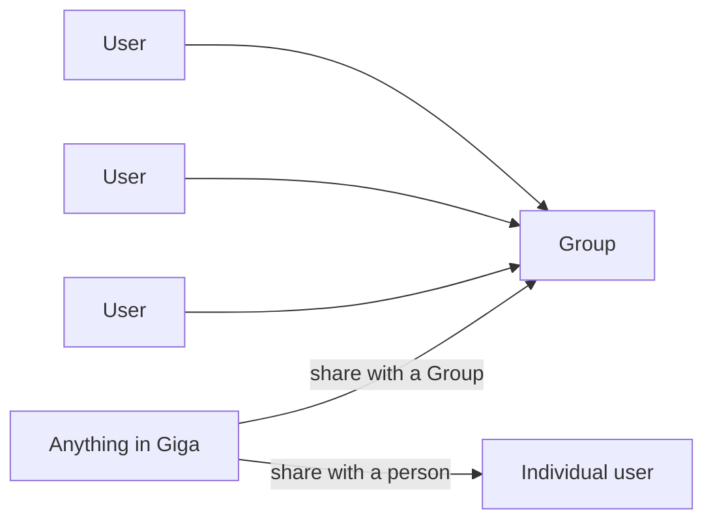

**Giga Core** is the foundation every Giga product sits on. It's how your team is organized in Giga, and how you control who can see and use what.

There are just three ideas to understand: **users**, **Groups**, and **sharing**.

## Users

Everyone on your team has their own Giga account. What you create in Giga starts out as **yours** — private to you until you decide to share it.

## Groups

A **Group** is a set of people — a team, a department, a project, or the whole company.

You add users to Groups, and Groups become the easy way to give the right people access to the right things. For example:

- a **Sales** Group for your sales team
- a **Leadership** Group for the exec team
- an **Everyone** Group for the whole company

## Sharing

Almost everything in Giga can be shared, in one of two ways:

<Columns cols={2}>
  <Card title="Share with a Group" icon="users">
    Everyone in the Group gets access — including people who join the Group later.
  </Card>
  <Card title="Share with a person" icon="user">
    Give one specific teammate access, without sharing it more widely.
  </Card>
</Columns>

The same model applies across Giga — to connections, skills, context, memory, workflows, and more. Learn it once, and it works the same way everywhere.

## Why it matters

- **Private by default.** Nothing is shared until you choose to share it.
- **One model everywhere.** The same rules apply in Giga Web, Slack, ChatGPT, and Claude.
- **Giga only uses what you can access.** When someone asks Giga a question, it only draws on the things that person has been given access to.
