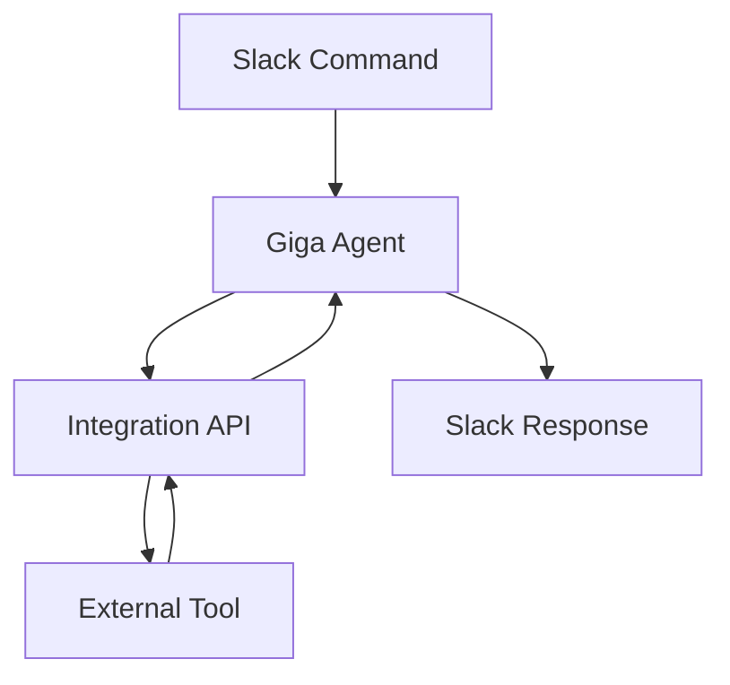

## Supported Integrations

Giga supports a wide range of popular tools to streamline your workflows. Connect your accounts to automate tasks across sales, finance, recruiting, and operations.

<Columns cols={3}>
  <Card title="Productivity" icon="calendar" href="/docs/integrations/productivity">
    Google Calendar, Notion
  </Card>
  <Card title="E-commerce" icon="shopping-cart" href="/docs/integrations/ecommerce">
    Shopify, Stripe
  </Card>
  <Card title="Marketing" icon="trending-up" href="/docs/integrations/marketing">
    SEMRush, Meta Ads, LinkedIn
  </Card>
  <Card title="Finance" icon="dollar-sign" href="/docs/integrations/finance">
    QuickBooks
  </Card>
  <Card title="CRM" icon="users" href="/docs/integrations/crm">
    Salesforce, HubSpot
  </Card>
  <Card title="Communication" icon="mail" href="/docs/integrations/communication">
    Gmail, X (Twitter)
  </Card>
</Columns>

<Callout kind="info">
  This list grows monthly. Check the dashboard for the latest additions and request new integrations via support.
</Callout>

## Connect an Integration

Follow these steps to connect any supported integration.

<Steps>
  <Step title="Navigate to Integrations" icon="settings">
    Open your Giga dashboard and click `Integrations` in the sidebar.
  </Step>
  <Step title="Select Tool" icon="plug">
    Choose the tool from the list, such as Google Calendar.
  </Step>
  <Step title="Authorize" icon="key">
    Click `Connect` and sign in to your account. Grant necessary permissions.
  </Step>
  <Step title="Test Connection" icon="zap">
    Run a test command like `@Giga list my meetings today` to verify.
  </Step>
</Steps>

## Pre-built Workflows

Giga offers ready-to-use workflows for common tasks. Select from the dashboard or customize them.

<Tabs>
  <Tab title="Organize Meetings" icon="calendar">
    Automates scheduling and reminders in Google Calendar.
    
    Example command: `@Giga organize my meetings today`
  </Tab>
  <Tab title="Boost Sales" icon="shopping-cart">
    Analyzes Shopify data and suggests optimizations.
    
    Example: `@Giga boost my Shopify sales`
  </Tab>
  <Tab title="Manage Cash Flow" icon="dollar-sign">
    Pulls QuickBooks data for insights.
    
    Example: `@Giga manage my cash flow`
  </Tab>
</Tabs>

## Webhooks and Custom Triggers

For advanced automation, use webhooks to trigger Giga actions from external events.

<CodeGroup tabs="JavaScript,Python">
  ```javascript
  const response = await fetch('https://api.example.com/v1/webhooks', {
    method: 'POST',
    headers: {
      'Authorization': 'Bearer YOUR_API_KEY',
      'Content-Type': 'application/json'
    },
    body: JSON.stringify({
      event: 'invoice.created',
      data: { amount: 1500 }
    })
  });
  ```
  ```python
  import requests

  response = requests.post(
      'https://api.example.com/v1/webhooks',
      headers={
          'Authorization': 'Bearer YOUR_API_KEY',
          'Content-Type': 'application/json'
      },
      json={
          'event': 'invoice.created',
          'data': {'amount': 1500}
      }
  )
  ```
</CodeGroup>

<ParamField header="Authorization" param-type="string" required="true">
  Bearer token for authentication.
</ParamField>

<ParamField body="event" param-type="string" required="true">
  Event name like `invoice.created` or `lead.new`.
</ParamField>

## Managing Connected Accounts

Keep your integrations secure and up-to-date.

<ExpandableGroup>
  <Expandable title="Revoke Access" default-open="true">
    Go to `Integrations > Connected Accounts`. Click the tool and select `Disconnect`.
  </Expandable>
  <Expandable title="Update Permissions">
    Reconnect the integration to refresh scopes. Review permissions during authorization.
  </Expandable>
  <Expandable title="Troubleshoot Issues">
    Check connection status. Common fixes: reauthorize or verify API limits.
  </Expandable>
</ExpandableGroup>

## Workflow Visualization



<Callout kind="tip">
  Monitor usage in the dashboard to optimize your automations and avoid rate limits.
</Callout>