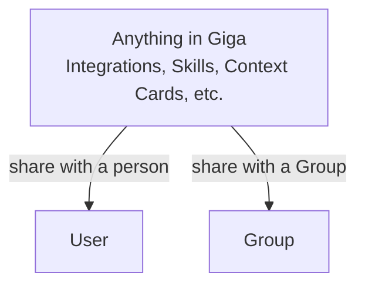

Giga brings company work, connected tools, and durable context into one AI workspace. The building blocks below help you decide **where work belongs**, **what Giga can access**, and **how repeatable work gets reused**.

## Users, Groups and sharing

Everything in Giga is built on one simple model for who can see and use what.

- **Users.** Everyone on your team has their own Giga account. What you create starts out private to you.
- **Groups.** A Group is a set of people, such as a team, a department, a project, or the whole company. You add users to Groups.
- **Sharing.** Almost anything in Giga can be shared with a whole Group or with one specific person.

The same model applies everywhere, in Giga Web, Slack, ChatGPT, and Claude, and Giga only ever draws on the things each person has been given access to.

## Explore Giga

<Columns cols="2">
  <Card title="Giga Connect" href="/connect/index" icon="plug" horizontal="false">
    Connect Giga to all your tools in one place, then connect them to other tools.
  </Card>

  <Card title="Giga Library" href="/library/index" icon="library" horizontal="false">
    Store shared resources your team can access wherever they are.
  </Card>

  <Card title="Giga Memory" href="/memory/index" icon="brain" horizontal="false">
    Shared memory for your whole company.
  </Card>

  <Card title="Giga Apps" href="/apps/index" icon="layout-grid" horizontal="false">
    Build applications on top of your data.
  </Card>

  <Card title="Giga Workspace" href="/workspace/index" icon="briefcase" horizontal="false">
    Workflows, Tracks, Agents and Pulses for getting work done.
  </Card>

  <Card title="Giga Chat" href="/chat/index" icon="message-square" horizontal="false">
    Web chat for your team, with all of the usual things you'd expect.
  </Card>

  <Card title="Giga Coworker" href="/coworker/index" icon="users" horizontal="false">
    Giga for Slack, Teams and ChatGPT.
  </Card>

  <Card title="Giga MCP" href="/mcp/index" icon="server" horizontal="false">
    Connect to Giga from whatever tools you use.
  </Card>
</Columns>
