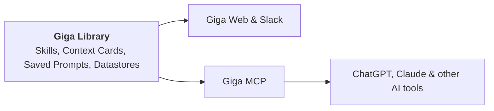

The **Giga Library** is where your team keeps the resources Giga uses to do great work: shared once, and available wherever your team works with Giga.

<Columns cols={2}>
  <Card title="Skills" href="/skills/index" icon="sparkles">
    Reusable instructions that teach Giga how to do a specific kind of work.
  </Card>
  <Card title="Context Cards" href="/library/context-cards" icon="id-card">
    Background and reference information Giga can draw on in any conversation.
  </Card>
  <Card title="Saved Prompts" href="/library/saved-prompts" icon="bookmark">
    The prompts your team uses most, saved so anyone can run them again.
  </Card>
  <Card title="Datastores" href="/library/datastores" icon="database">
    Structured data your team and Giga can read and update.
  </Card>
</Columns>

## Use your library everywhere

Store an item in the Library once, and your team can use it wherever they work with Giga: in Giga Web and Slack, and in other AI tools like ChatGPT and Claude through [Giga MCP](/mcp/index).

- **Use them:** ask for a skill, pull in a Context Card, or run a Saved Prompt from any connected tool.
- **Edit them:** update library items directly from ChatGPT, Claude or any MCP-connected tool. Changes are saved back to the Library, so everyone gets the latest version.
- **Open them (coming soon):** open a library item, such as a skill, right inside ChatGPT or Claude to view and edit it there.

One library, kept in one place, means your whole team works from the same instructions, context and data, whichever tool they prefer.

## Sharing library items

Library items follow the same [sharing model](/introduction#users-groups-and-sharing) as everything else in Giga. Items start out private to you, and you can share them with a Group or with specific people.

## Frequently asked questions

<ExpandableGroup>
  <Expandable title="Can my team use library items outside Giga?">
    Yes. Through Giga MCP, your team can use and edit library items from ChatGPT, Claude and other AI tools, without copying anything across.
  </Expandable>
  <Expandable title="If someone edits a skill in ChatGPT, does everyone see the change?">
    Yes. Edits made through Giga MCP are saved back to the Library, so everyone with access gets the updated version wherever they use it.
  </Expandable>
  <Expandable title="Who can see the items in our library?">
    Only the people they've been shared with. Items start out private to the person who created them, and can be shared with a Group or with specific people.
  </Expandable>
  <Expandable title="What's the difference between a Skill and a Context Card?">
    A Skill tells Giga **how** to do something, such as writing a sales proposal your way. A Context Card tells Giga **what** to know, such as your pricing or your brand guidelines.
  </Expandable>
  <Expandable title="What's the difference between a Saved Prompt and a Skill?">
    A Saved Prompt is a request you run, like a shortcut for something you ask often. A Skill is a method Giga follows whenever that kind of work comes up.
  </Expandable>
</ExpandableGroup>
