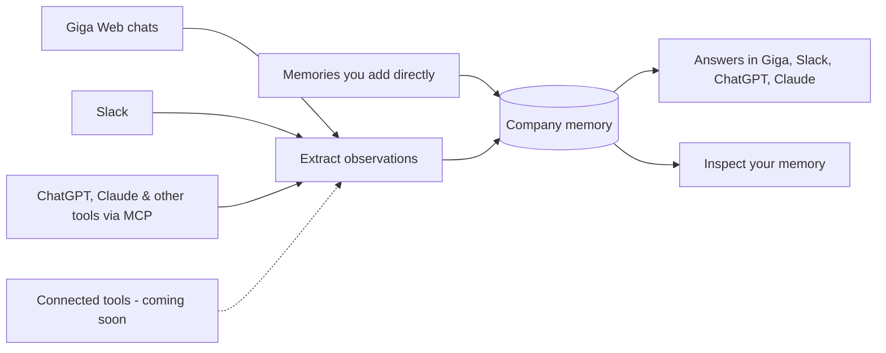

**Giga Memory** is shared memory for your whole company.

As your team works with Giga — in the web app, in Slack, or from tools like ChatGPT and Claude — Giga picks up what people are working on, pulls out the useful details, and keeps them in one place that Giga can search.

The result is an organizational memory that understands what's going on across the business, so anyone on your team can ask questions and get answers in real time.

## More than personal AI memory

Tools like ChatGPT and Claude remember things about **you**. Giga Memory remembers things about **your company**.

| Personal AI memory | Giga Memory |
| --- | --- |
| Remembers one person's preferences and chats | Learns from your whole team's work |
| Lives inside one app | Captures from Giga Web, Slack, ChatGPT, Claude, and more |
| Answers "what do I like?" | Answers "what's happening across the business?" |
| Private to one user | Shared with the right people, based on access |

## How information flows into memory

## Observations

The building blocks of Giga Memory are **observations**: short records of something useful that came up in your team's work.

Observations capture things like:

- a decision that was made
- a change in direction
- an important fact that was learned
- progress on a piece of work
- a preference or constraint worth remembering

Giga extracts observations automatically, so your team doesn't have to stop and write things down.

## Ways information gets into memory

<Columns cols={2}>
  <Card title="From conversations" icon="message-square">
    Giga extracts observations from your team's conversations with Giga, wherever they happen — Giga Web, Slack, ChatGPT, Claude, and other MCP-connected tools.
  </Card>
  <Card title="Added directly" icon="plus-circle">
    Save a memory on purpose from any tool connected through [Giga MCP](/mcp/index).
  </Card>
  <Card title="From your tools (coming soon)" icon="plug">
    Giga will scan your [connected tools](/connect/index) and extract observations from them too.
  </Card>
</Columns>

## Ask your company anything

Because memory spans your whole team, Giga can answer questions no single person or chat history could.

> **Placeholder**
>
> List of example questions Giga Memory helps answer — to be added.

## Inspect your memory

You can look inside your company's memory to see what Giga has captured, so it's never a black box.

_Placeholder — details coming soon._

## Memory follows access

Giga Memory respects your workspace permissions. People only get answers drawn from the information they're allowed to see, based on [Groups](/groups/index) and [Tracks](/tracks/index).

## Related pages

- [Track memory](/tracks/memory)
- [Giga MCP](/mcp/index)
- [Giga Connect](/connect/index)
